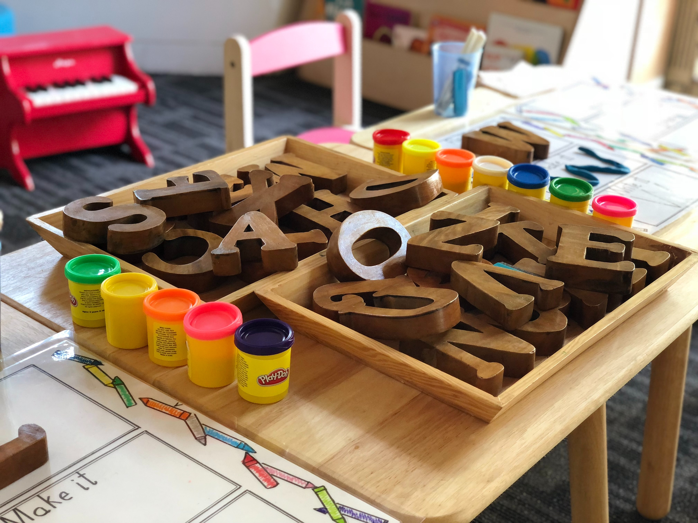
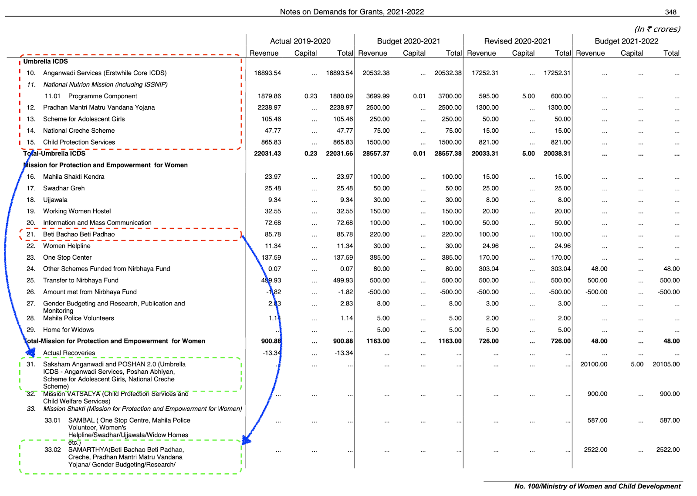
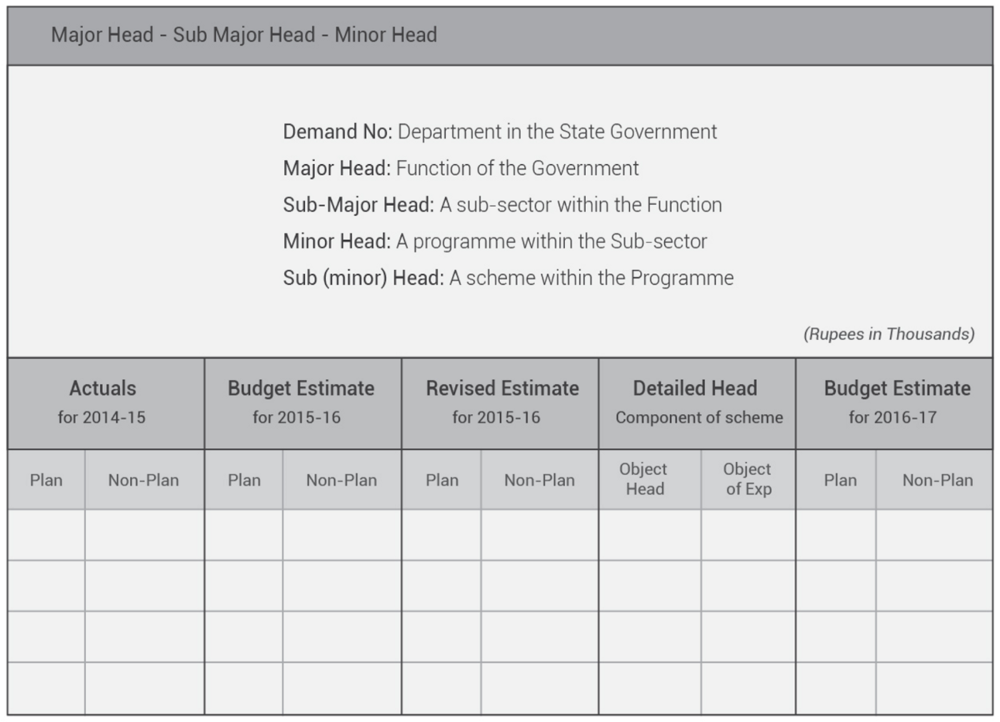
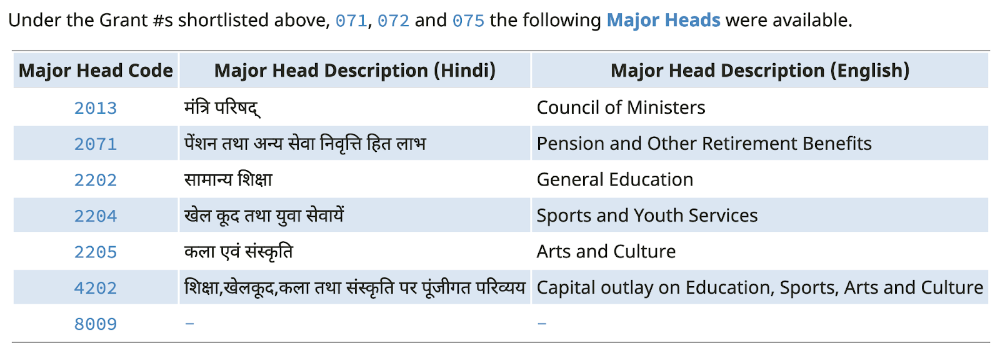
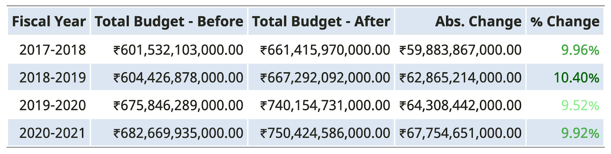

```{r, layout = "l-body-outset", echo = FALSE}

```

<span style="font-size:smaller;">_Figure from [Unsplash](https://unsplash.com/){target="_blank"} by [Gautam Arora](https://unsplash.com/@gautamarora1991){target="_blank"}._</span>

COVID-19 has had an unprecedented impact affecting a large number of children across states, class, caste, gender and region. In India, school closures have affected 320 million students and only 37.6 million children across 16 states were able to continue education through various initiatives such as online classrooms and radio programmes etc. ^[Education: From disruption to recovery, UNESCO, accessed on 7th May, 2021, [https://en.unesco.org/covid19/educationresponse](https://en.unesco.org/covid19/educationresponse){target="_blank"}] A survey by Save the Children during the pandemic reported the discontinuation of children’s education in 62% of the surveyed households with 67% in rural and 55% in urban areas, respectively. ^[Rights of Vulnerable Families and Children of India under COVID-19, Save the Children, accessed on 7th May, 2021, [https://resourcecentre.savethechildren.net/node/18102/pdf/rights_of_vulnerable_families_and_children_of_india_under_covid_240720f.pdf](https://resourcecentre.savethechildren.net/node/18102/pdf/rights_of_vulnerable_families_and_children_of_india_under_covid_240720f.pdf){target="_blank"}]

The shutting down of schools and the decision of shifting traditional classrooms to digital platforms is not only increasing learning inequality among children, but also pushing a large number of children out of school due to the digital divide. While 24% Indians own a smartphone, only 11% of households possess any form of computer and just 24% of Indian households have an internet facility. ^[Key Indicators of Household Social Consumption on Education in India 2017-18, MOSPI, accessed on 7th May, 2021, [http://mospi.nic.in/sites/default/files/publication_reports/Report_585_75th_round_Education_final_1507_0.pdf](http://mospi.nic.in/sites/default/files/publication_reports/Report_585_75th_round_Education_final_1507_0.pdf){target="_blank"}] Other than learning, the absence of schooling would also have a long-lasting effect on the health and nutrition of children.

Girls in India are specifically struggling to access and complete their school education. U-DISE Flash Statistics for 2016–17 show that adolescent girls are more likely to drop out from secondary education (19.8%) than primary education (6.3%) and this number is higher for government schools (26.8%). ^[U-DISE FLASH STATISTICS 2016-17, National Institute of Educational Planning and Administration, accessed on 7th May, 2021, [http://udise.in/Downloads/Publications/Documents/Flash_Statistics_on_School_Education-2016-17.pdf](http://udise.in/Downloads/Publications/Documents/Flash_Statistics_on_School_Education-2016-17.pdf){target="_blank"}] The Malala Fund estimates that 10 million more secondary school age girls could be out of school after the COVID-19 crisis has passed and a substantial number of these children will be from developing countries like India. ^[Girls' education and COVID-19, Malala Fund, accessed on 7th May, 2021, [https://malala.org/newsroom/archive/malala-fund-releases-report-girls-education-covid-19](https://malala.org/newsroom/archive/malala-fund-releases-report-girls-education-covid-19){target="_blank"}]

The Centre and States together invest ~2.9% of GDP on school education, much lower than 6% recommended by the National Policy on Education 1968 and reaffirmed by the National Education Policy, 2020 (NEP). Samagra Shiksha Abhiyan (SMSA), the key programme for providing holistic school education remains under-funded. In 2020–21 (Budget Estimates), against a projected demand of Rs. 45,934 crore, the scheme has received an allocation of Rs. 38,750 crore. ^[Decoding the Priorities An Analysis of Union Budget 2020-21, CBGA, accessed on 7th May, 2021, [http://www.cbgaindia.org/wp-content/uploads/2020/02/Decoding-the-Priorities-An-Analysis-of-Union-Budget-2020-21-2.pdf](http://www.cbgaindia.org/wp-content/uploads/2020/02/Decoding-the-Priorities-An-Analysis-of-Union-Budget-2020-21-2.pdf){target="_blank"}] The pattern of resource allocation in girl-specific interventions across different components of SMSA shows that in most states, residential schools and RTE entitlements for free uniforms top the charts as key areas of investments to promote girls’ education. However, other critical interventions, like the safety and security of girls, recruitment of female teachers, or gender-sensitisation training for teachers, are either sparsely allocated or have no allocation at all. ^[Samagra Shiksha Abhiyan (SMSA) from the Girls' Education Lens, CBGA, accessed on 7th May, 2021, [https://www.cbgaindia.org/wp-content/uploads/2019/04/SMSA-from-the-Girls-Education-Lens-An-Initial-Analysis.pdf](https://www.cbgaindia.org/wp-content/uploads/2019/04/SMSA-from-the-Girls-Education-Lens-An-Initial-Analysis.pdf){target="_blank"}]

We face a big challenge, in terms of providing equitable access to education for all children across the country and the second wave of the pandemic has exacerbated these issues to a whole new level. Public funding towards this has been riddled with issues of under resourcing, under utilisation and misallocation. Amidst this humanitarian crisis, it is critical to have clear information on the amount of funds and how these funds are being utilised to serve the children in this country.

# The Budget Cycle

Every year in the first week of February, the Union Budget is presented by the Finance Minister in the Parliament. The budget determines the government’s take on their promises, past decisions and detailed prioritizations across sectors. Budgets are leveraged as a tool for enabling trust in the government’s financial activities by providing transparency on public funds and can act to support impactful and equitable public policies. Government budgets are globally considered as ‘moral documents’, reflecting the priorities and values of the state and its people. ^[Lives of Data: Essays on Computational Cultures from India, Gaurav Godhwani, accessed on 7th May, 2021, [https://networkcultures.org/wp-content/uploads/2021/02/Lives-of-Data-.pdf](https://networkcultures.org/wp-content/uploads/2021/02/Lives-of-Data-.pdf){target="_blank"}]

Soon after the Union Budget is released, the states follow suit and share their plans and priorities for the financial year. Implementation of these budget proposals and policies is carried out by numerous ministries and agencies across all tiers of the government. If you are fascinated by how this cycle works, I would strongly recommend checking out [Budget Basics](https://openbudgetsindia.org/budget-basics/intro.html){target="_blank"} by Open Budgets India, a fairly comprehensive guide to understanding the mechanics of arguably the most important document released by the government every year.

# Scrutinizing the Budgets

A key aspect of the process of presenting budgets every year is that they are also released in the public domain by the government. The intention is to engage citizens in public reform by empowering them with access to information about the allocation and utilisation of funds available to various public authorities. The process is also meant to increase transparency and accountability in the functioning of every publicly funded institute.

However, the reality is far from it. Public financing is a complex issue requiring knowledge and understanding of the intricacies of fund flow to better holistically track the flow of funds.

> **Civic(Engagement)DataLab**
> 
> Civic engagement has been a key factor in all the solutions we have built at CivicDataLab over the last 3 years. Our mission is to “strengthen the course of civic engagements in India by harnessing the potential of open knowledge movements.”. The mission statement of our public financing open data platform [Open Budgets India](https://openbudgetsindia.org/){target="_blank"} is “Making India’s Budgets open, usable and easy to comprehend”. Civic engagement, in our experience, is a challenging task that requires regular interventions to equip the citizenry with the right information and skills to turn that information into knowledge and action.

## Tracking the Fund Flow

Going back to the budgets, the structure of the Union Budget is such that it contains numerous Demand for Grants which estimates the expenditure a Ministry will make through its various departments. Let’s take the case of education, to know more about the fund flow one would follow the Ministry of Education, specifically the Department of School Education and Literacy, which was allocated ₹54,874 crore and the Department of Higher Education which was allocated ₹38,351 crore, accounting for 59% and 41% of the Ministry’s total estimated expenditure respectively. There is also education related expenditure flowing outside of the Ministry of Education, for example through the Ministry of Women and Child Development by the means of Centrally Sponsored Schemes like ICDS (Anganwadi Services) and Beti Bachao Beti Padhao. ^[Expenditure Budget 2021-22, Statement of Budget Estimates, Ministry of Finance, accessed on 7th May, 2021, [https://www.indiabudget.gov.in/doc/eb/allsbe.pdf](https://www.indiabudget.gov.in/doc/eb/allsbe.pdf){target="_blank"}] Over the years, the structures and nomenclature of the schemes have also evolved, with Umbrella ICDS becoming a part of Saksham Anganwadi and POSHAN 2.0 and Beti Bachao Beti Padhao becoming a part of Mission Shakti SAMARTHYA.

```{r, layout = "l-body-outset", echo = FALSE}

```

<span style="font-size:smaller;">_Figure from [Expenditure Budget 2021–22, Statement of Budget Estimates](https://www.indiabudget.gov.in/doc/eb/allsbe.pdf){target="_blank"}._</span>

With all these intricacies, and changes to the fund flow structure it becomes challenging to keep a track of government expenditure of key sectors like education without having subject matter expertise in areas like public financing, education, data literacy or all of them at the same time. Information of such nature is critical for key stakeholders like CSOs, researchers and citizens to keep their local administrations accountable. The civic engagement goal post seems much farther that it did before.

# The Uttar Pradesh use case

The challenges faced in tracking fund flow at the national level also extend to states. Since the last few months, we have been focussing on understanding the public financing related to girl child education in rural Uttar Pradesh.

> **About The Project**
> 
> CivicDataLab is partnering with [HAQ: Centre for Child Rights](https://www.haqcrc.org/){target="_blank"} (HAQ: CRC) to build Girl Education and Well-Being Spending Tracker, an online interactive portal to explore the fund flow towards girl education in two aspirational districts of Uttar Pradesh, Bahraich and Shravasti.
> 
> One of the key objectives of the project is to examine and highlight the trend of public financing for child education with specific focus on girls’ education in the state of Uttar Pradesh. You can follow the live project [here](https://github.com/CivicDataLab/up-fiscal-data){target="_blank"}.

We observed similar trends, where education related expenditure could be observed under the Department of Social Welfare through Tribal Welfare and Special Component Plan for Scheduled Castes grants. Additionally schemes like Kanya Sumangala Yojana, KG to PG Scheme and Bhagya Laxmi Yojana started by the state government to focus on this specific issue are difficult to track.

To overcome challenges of this nature, the Controller General of Accounts, Department of Expenditure, Ministry of Finance mandates the use of the same [**Major and Minor Heads of Accounts**](http://cga.nic.in/DownloadPDF.aspx?filenameid=1537){target="_blank"} across all Union and State expenditures. Adhering to the same, the government budgeting system followed in India makes it easier to identify expenditure for particular requirements through budget codes / budget heads used for reporting disbursements and receipts in the union and state budgets.

```{r, layout = "l-body-outset", echo = FALSE}

```

<span style="font-size:smaller;">_Figure from Format of the Detailed Demands for Grants and Accounting Heads  [Budget Basics](https://openbudgetsindia.org/budget-basics/states-budget.html){target="_blank"}, Open Budgets India._</span>

We used the same Budget Codes / Budget heads to identify girl child related education expenditure for the State of Uttar Pradesh.

## The Identification Process

Our starting point was looking at the Demand for Grants related to the Department of Education. The following 3 Demand for Grants were identified to be the scope:

- **071** — Department of Education (Primary Education)
- **072** — Department of Education (Secondary Education)
- **075** — Department of Education (State Council for Educational Research and Training)

Under these three Demand for Grants, there were 7 Major Accounting Heads, available through which the education related expenditure was flowing for the state.

```{r, layout = "l-body-outset", echo = FALSE}

```

## Major Accounting Heads

Amongst the Major Heads identified, most of the funds were flowing through **2202** — the major head for General Education. Tracking General Education across the entire Uttar Pradesh Fiscal Data, we identified that expenditure against the code is available against 10 different Demand for Grants across the Department of Language, Department of Social Welfare, Department of Administrative Reforms and more. Similarly, other Major Heads can also be tracked to track the breath and breakdown of fund flow for Education in Uttar Pradesh. You can find the detailed analysis on the same [**here**](https://up-girl-ed-1.netlify.app/){target="_blank"}.

## Scoping out Education

In the process of conducting this exercise, we were able to redefine the scope of how we look at Education related expenditure for the state and identified ~₹6000 crores of additional budget available under education related heads for each financial year, increasing the funds available by ~10% .

As we move forward, by further identifying sub-major and minor heads our definition will evolve and become more nuanced in understanding the education financing for the state. These accounting heads will also help us identify key schemes around education and track their fund flow. You can find the latest iteration of the scope [**here**](https://github.com/CivicDataLab/up-fiscal-data/blob/main/data-scoping/education-definition.md){target="_blank"}.

```{r, layout = "l-body-outset", echo = FALSE}

```

# The Way Forward

Setting a scope for education related expenditure creates a huge opportunity to scale the efforts of tracking fund flow across the country. We hope to take the following steps expand on our current work:

- Refine the definition by going deeper into various sub-major / minor accounting codes for education related heads.
- Use the definition to expand to other states and compare their performance on similar criterias to increase fiscal accountability.
- Create an open resource that will enable key stakeholders to reuse, repurpose the definition for their use cases and track the fund flow.

# A fiscal definition for Education

This enhanced understanding of the scope of education-related expenditure for the state of Uttar Pradesh is an important opportunity to create a robust definition for the same. A fiscal definition that will help bring further clarity into what are the components of education expenditure.

This definition could enable key stakeholders like CSOs, research organisations and citizens to not only analyse and critique the education related expenditure for any geography but also modify the definition to get an accurate picture for their specific use cases. And since the definition is based on nationally agreed accounting codes, the same can be used for other states to get a clearer picture of the state of education financing with minimal intervention.

This ability to reuse and repurpose the definition for numerous use cases by key stakeholders presents a unique opportunity that bridges the access to information gap drastically, and empowers citizens to further engage with their local administrations to demand better reform.

> This is the third article in the series to better understand the state of Public Financing for Education in the state of Uttar Pradesh. Click on the links to read [**Part 1**](https://medium.com/civicdatalab/strengthening-financial-accountability-towards-girl-education-b9e3ba9be7d9){target="_blank"} and [**Part 2**](https://medium.com/civicdatalab/budget-ed-tech-covid-19-era-7b37afe561ee){target="_blank"}.

## Acknowledgments {.appendix}

A big thank you to [Arun Sudarsan](https://twitter.com/mrarunsudarsan){target="_blank"} and [Upasana Hembram](https://twitter.com/watzernehm){target="_blank"} for reviewing the piece and [CivicDataLab](https://civicdatalab.in/){target="_blank"} for publishing it.

## Author Contributions {.appendix}

Arpit Arora conceived of the presented idea, researched the theory and analysed findings.
